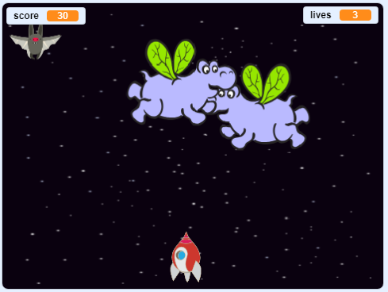
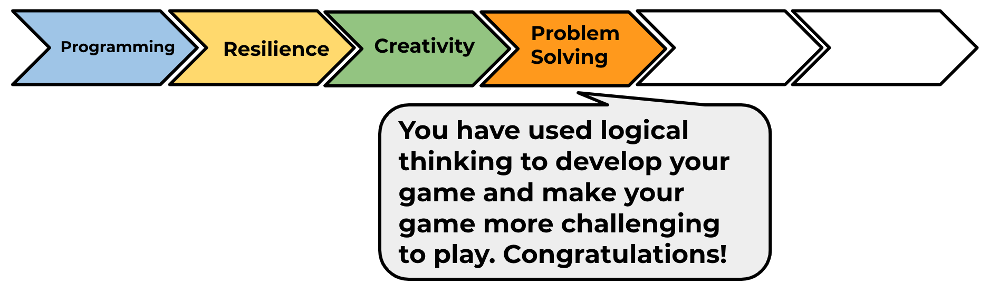

## What have you learned?

Try the 'Clone wars' project to make a game in which you have to save the Earth from space monsters. In that project, you will be able to use what you have learned about cloning sprites and adding a score!

You will find this project in the module pathway.

--- no-print ---

Click the green flag in the example game below to start, and then press the <kbd>left</kbd> and <kbd>right</kbd> arrow keys to move the spaceship, and the <kbd>space</kbd> key to shoot.

  <iframe allowtransparency="true" width="485" height="402" src="https://scratch.mit.edu/projects/embed/276887163/?autostart=false" frameborder="0" scrolling="no"></iframe>
  

--- /no-print ---

Score as many points as you can by shooting flying space-hippos. If you get hit by a hippo or by an orange dropped by the bats, you lose a life.

--- print-only ---

--- /print-only ---

Click on the 'Click me' button to try the next project:

<a href="https://codeclub.org/en/scratch2">

